# 📈 Análise de Vendas e Desempenho das Lojas

## 🎯 Objetivo do Projeto
Compreender o desempenho individual e comparativo de nossas unidades de venda é crucial para otimizar estratégias e impulsionar o crescimento. Este projeto analisa a performance das unidades `Loja-1`, `Loja-2`, `Loja-3` e `Loja-4`, buscando identificar insights valiosos sobre faturamento, logística e satisfação do cliente.

---

## 🔍 Pilares da Análise (Métricas)

Para responder às perguntas-chave do negócio, o notebook explora as seguintes métricas fundamentais:

### 1. Faturamento Total
Análise do volume financeiro gerado por cada unidade para estabelecer o ranking de receita bruta entre as lojas.

  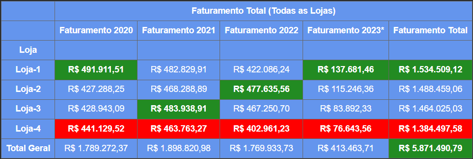

  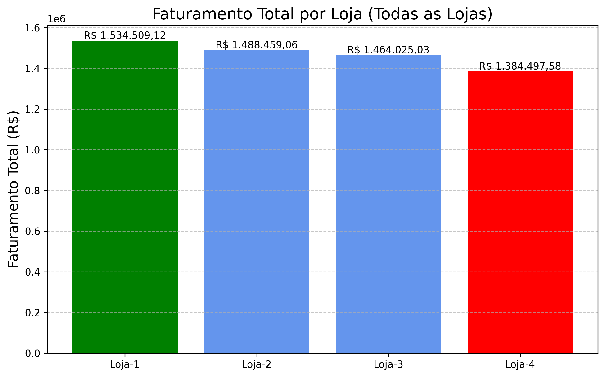

> **Insight:** Observa-se um sólido desempenho na `Loja-1`, enquanto a `Loja-4` apresenta o faturamento mais baixo da rede.

### 2. Vendas por Categoria
Exploração do mix de produtos para identificar quais categorias performam melhor em cada loja.

  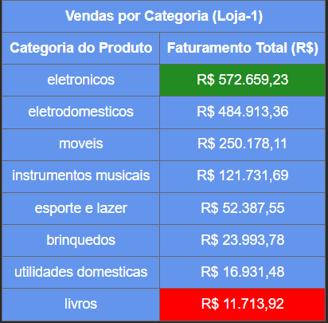
  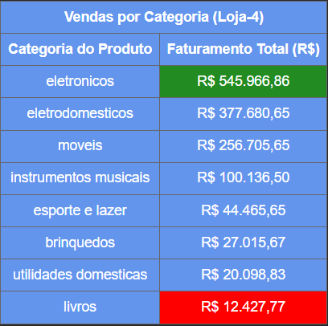

A `Loja-1` lidera por categoria de vendas e a `Loja-4` fica com o pior desempenho.

  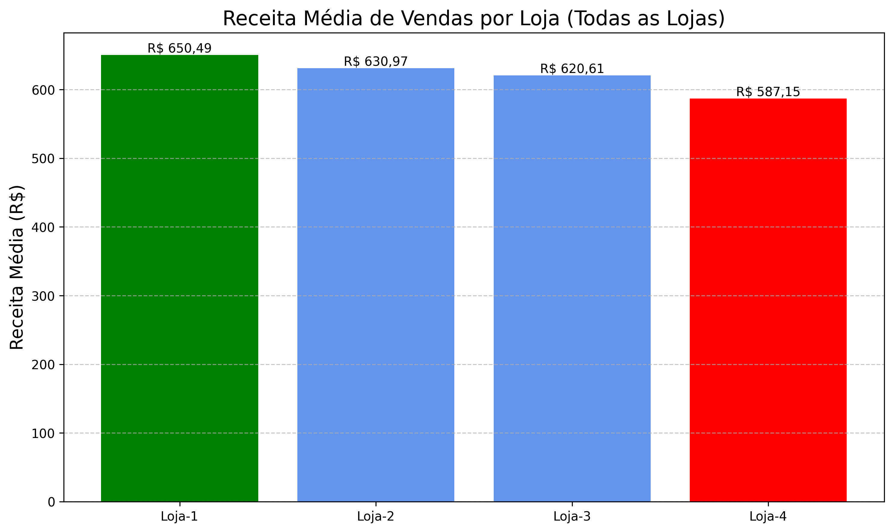

### 3. Média de Avaliação das Lojas
Monitoramento da satisfação do cliente, com notas de avaliação de 1 a 5.

  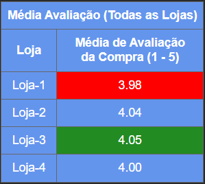

* **Destaque:** `Loja-3` apresenta a melhor média de avaliação.
* **Ponto de Atenção:** A `Loja-1` possui a pior média de avaliação. Apesar de liderar em faturamento, este indicador sugere a necessidade de melhorias operacionais ou de atendimento para manter a fidelidade do cliente.

### 4. Produtos Mais e Menos Vendidos
Identificação dos itens "Best Sellers" e daqueles com baixa rotatividade para auxílio na gestão de estoque.

#### 🏆 Top 5 Produtos Globais por Receita
| Ranking | Produto | Preço |
| :--- | :--- | :--- |
| 1º | TV Led UHD 4K | R$ 576.652,70 |
| 2º | Celular Plus X42 | R$ 534.735,14 |
| 3º | Geladeira | R$ 513.249,34 |
| 4º | Smart TV | R$ 386.963,12 |
| 5º | Lavadora de roupas | R$ 323.292,37 |

  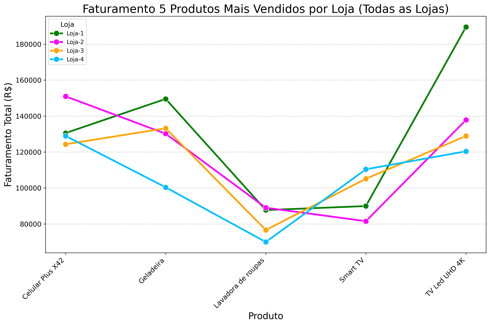

#### 📉 Menos Vendidos (Baixa Receita)
| Ranking | Produto | Preço |
| :--- | :--- | :--- |
| 1º | Jogo de copos | R$ 7.445,28 |
| 2º | Xadrez de madeira | R$ 6.865,90 |
| 3º | Dinossauro Rex | R$ 4.150,53 |
| 4º | Corda de pular| R$ 4.090,93 |
| 5º | Cubo mágico 8x8 | R$ 3.638,68 |

  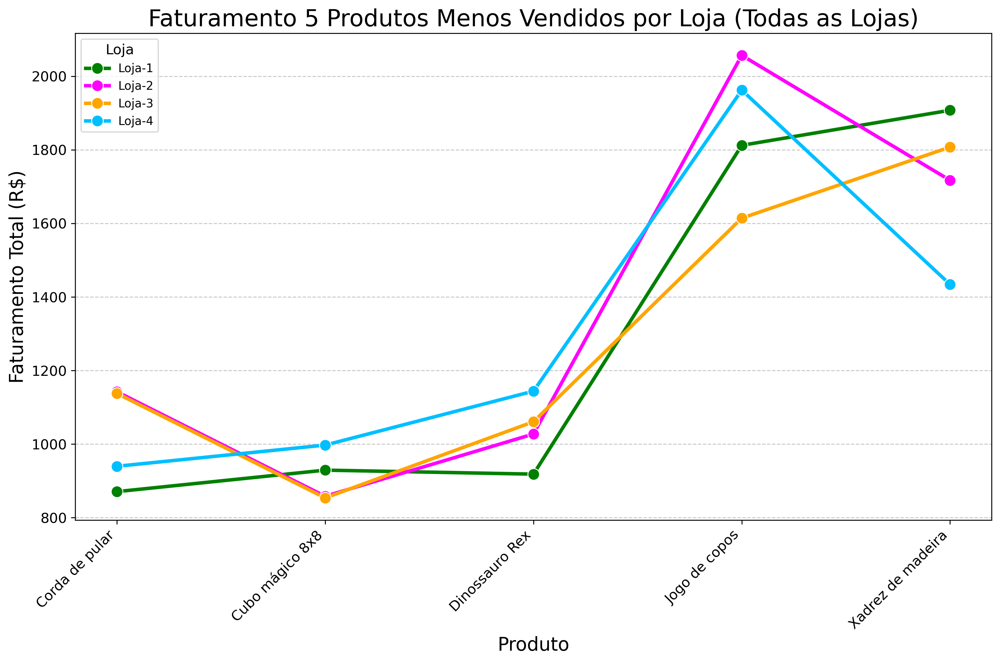

### 5. Frete Médio e Eficiência Logística
Avaliação do impacto dos custos logísticos na atratividade de cada unidade.

  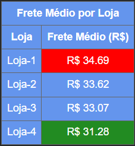

* **Análise Logística:** A `Loja-1` apresenta o pior desempenho em custo de frete. Na `Loja-4`, fretes elevados reduzem diretamente o volume de vendas.

  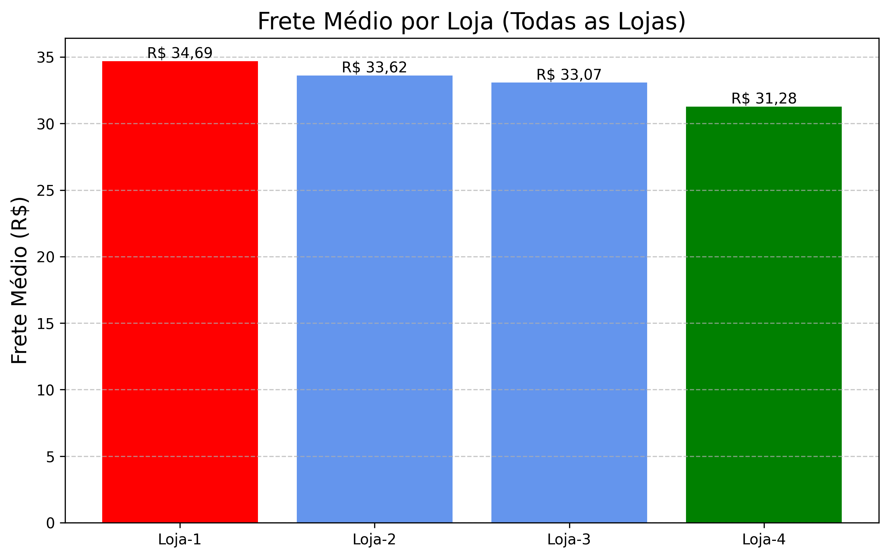

  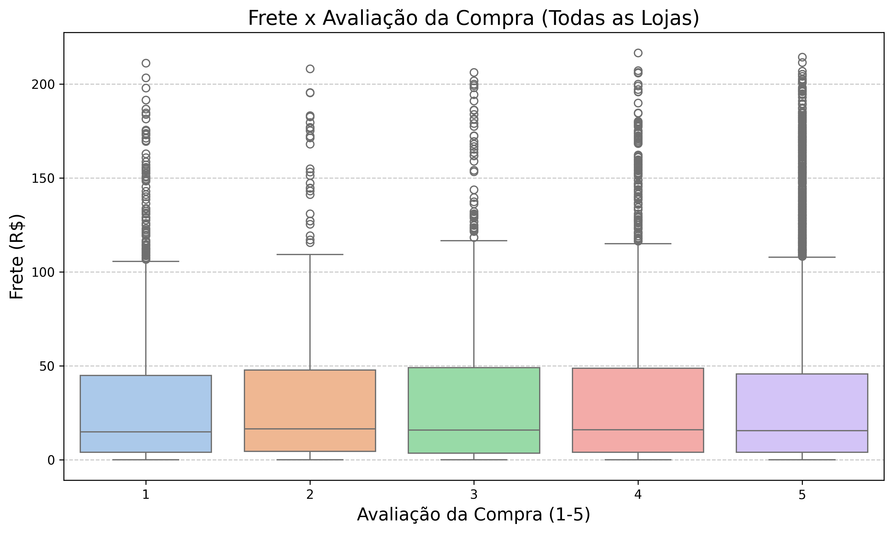

> **Impacto na Satisfação:** Fretes mais caros concentram-se em avaliações médias (2 a 4). Já avaliações extremas (1 e 5) ocorrem em fretes baixos, indicando que a qualidade do produto pesa mais que o envio nestes casos.

### 6. Desempenho Geográfico
Estudo de como a localização influencia os resultados de faturamento via coordenadas geográficas.

  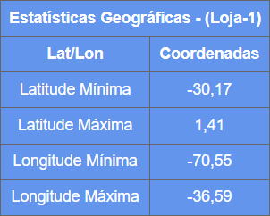
  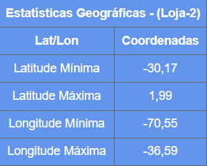
  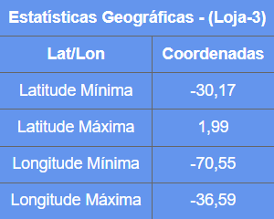
  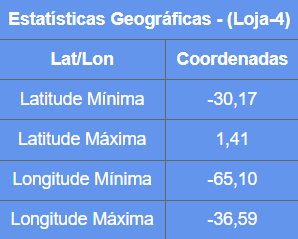

  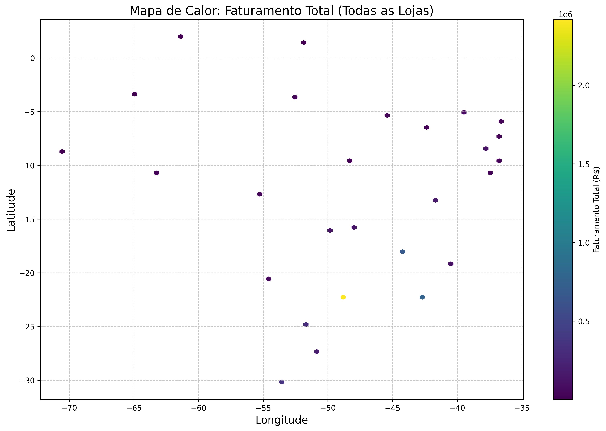

> **📍 Insight Geográfico:** O faturamento concentra-se no **interior de São Paulo**, consolidando o estado como o território de maior relevância.

### 7. Tendência de Faturamento (Séries Temporais)
Análise histórica para identificar padrões de crescimento e gaps competitivos.

  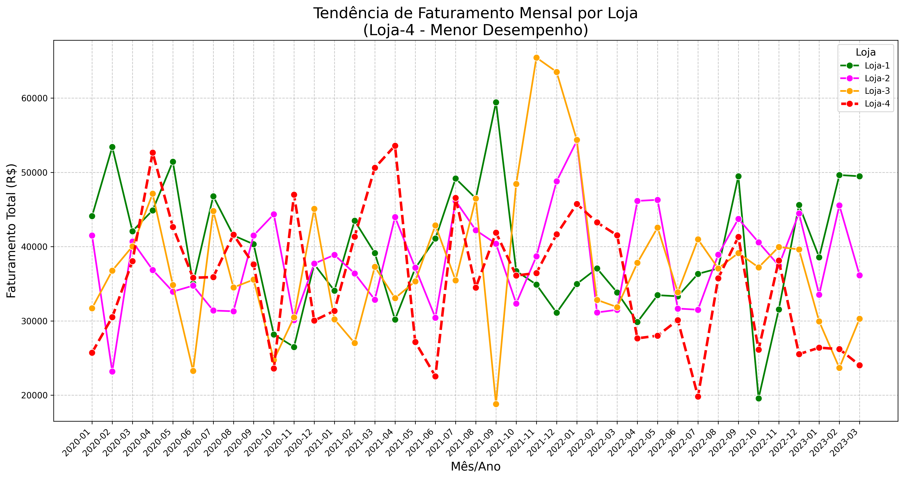

* **Diagnóstico:** As Lojas 1, 2 e 3 mantêm estabilidade. A `Loja-4` apresenta dificuldades de tração e um declínio constante.

  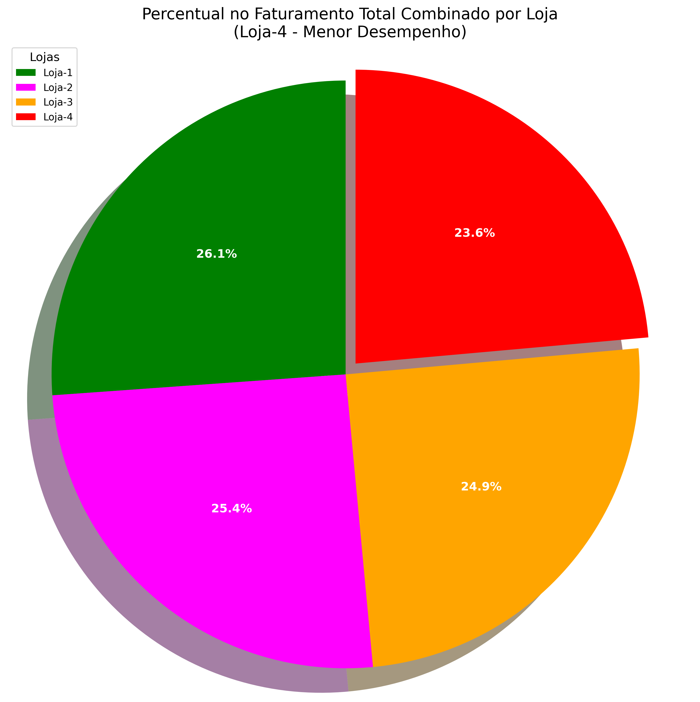

* **Share de Receita:** A `Loja-4` contribui com apenas **23,6%** do total, reforçando a necessidade de revisão estratégica.
---

## 💡 Conclusão e Recomendação Estratégica

Os dados revelam que a `Loja-4` apresenta o **desempenho mais crítico do grupo**.

**Principais Desafios:**
* Faturamento abaixo da média e tendência negativa.
* Custo logístico elevado impactando a margem.

**Recomendação Executiva:** Reestruturação operacional imediata ou avaliação de `fechamento da Loja-4` para reinvestimento em áreas com maior ROI.

---

## 🛠️ Tecnologias Utilizadas

*  **Python**: Linguagem principal para análise.

* **Pandas**: Manipulação de dados.

*  **NumPy**: Cálculos numéricos.

*  **Matplotlib**: Geração de gráficos e visualizações estáticas.

*  **Seaborn**: Visualizações estatísticas refinadas.

*  **Google Colab**: Ambiente de desenvolvimento.

---

## 🚀 Como Executar

1. Clone o repositório.

2. Instale as dependências: <code>pip install pandas numpy matplotlib seaborn</code>.

3. Execute o notebook <code>AluraStoreBrasil.ipynb</code>.

---
---
**Desenvolvido por:** [Wagner Bruni Batista]

